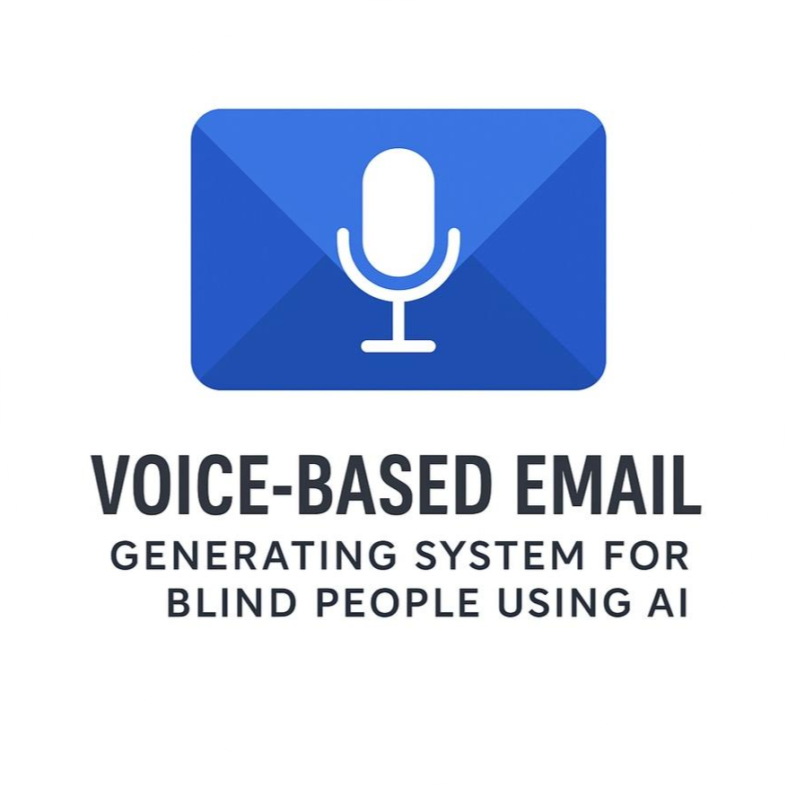
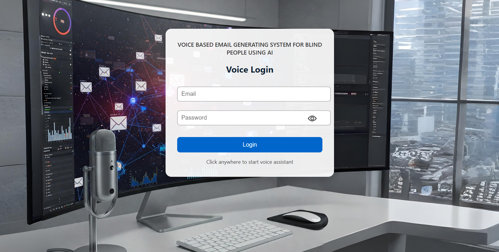
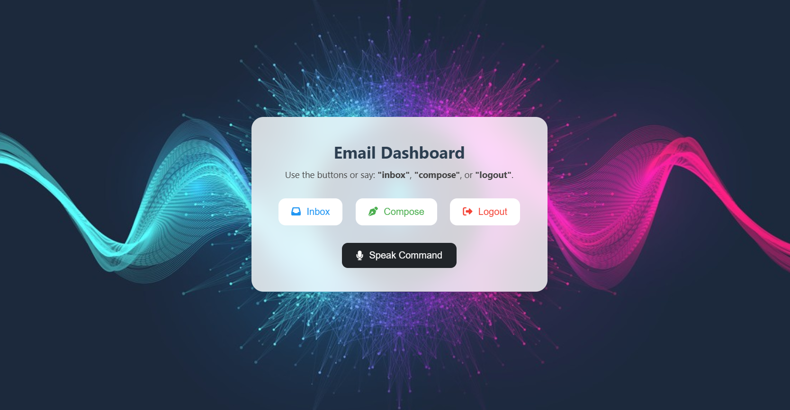
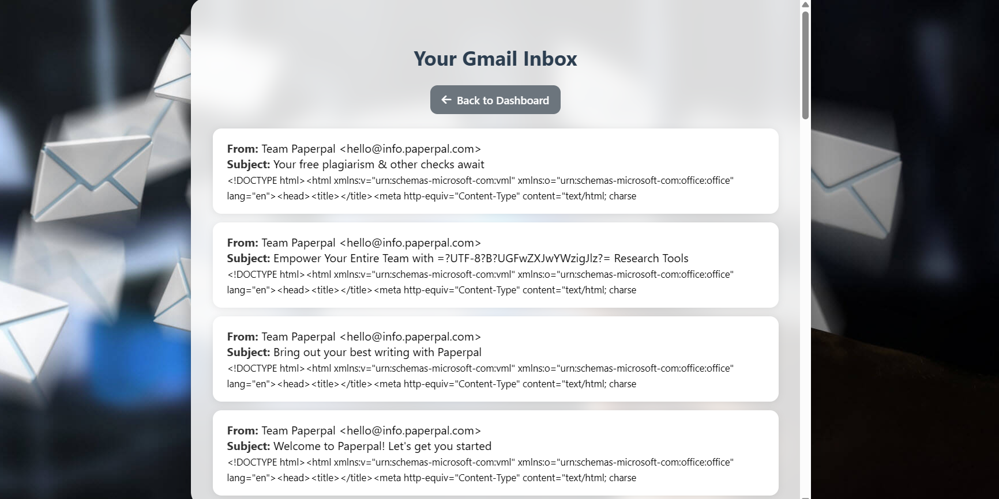
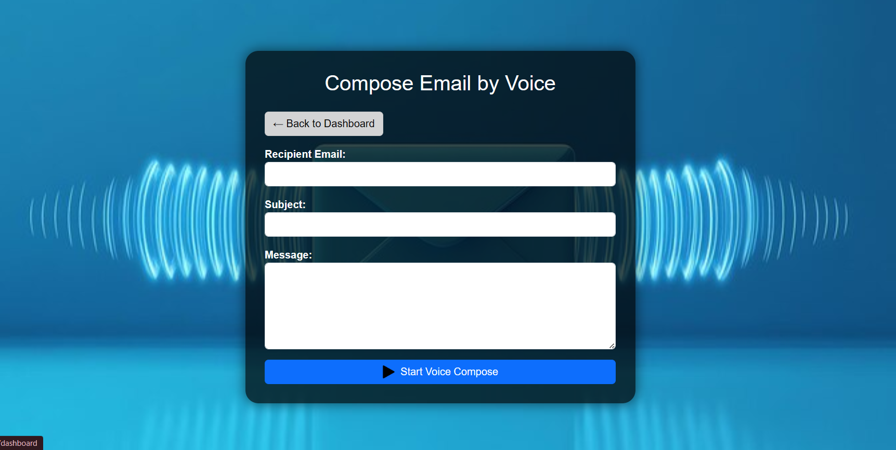

<a name="readme-top"></a>

<!-- PROJECT LOGO -->
<br />
<div align="center">
<a href="https://github.com/Varaprasad2098/Voice-Based-Email-Generation-System-for-Blind-People">
<!-- Replace with your logo image -->

</a>

<h3 align="center">Voice-Based Email Generation System for Blind People using AI</h3>

<p align="center">
An AI-powered voice-controlled email system designed to help visually impaired users send and manage emails effortlessly.
<br />
</p>
</div>

---

## 📸 Screenshots

<!-- Replace with your screenshots -->
### Login Page


### Dashboard


### Inbox


### Compose Email


<p align="right">(<a href="#readme-top">back to top</a>)</p>

---

## 🛠 Built With

[![Python][python-shield]][python-url]  
[![Flask][flask-shield]][flask-url]  
[![AI Speech Recognition][speech-shield]][speech-url]


<p align="right">(<a href="#readme-top">back to top</a>)</p>

---

## 📋 Prerequisites

You will need the following installed on your system before running the project:

- **Python 3.8+** ([Download here](https://www.python.org/downloads/release/python-380/))  
  *Make sure to check "Add Python to PATH" during installation.*
- **Visual Studio Code** ([Download here](https://code.visualstudio.com/download))
- **pip** (comes with Python)

---

## ⚙ Installation

1. **Open gitbash or terminal and Clone the repository**
   ```sh
   git clone https://github.com/Varaprasad2098/Voice-Based-Email-Generation-System-for-Blind-People.git
2. **Navigate to project directory**
   ```sh
   cd Voice-Based-Email-Generation-System-for-Blind-People
3. **Install dependencies**
   ```sh
   pip install -r requirements.txt

---

## ▶ Execution Steps

1. **Run the application**
   ```sh
   python app.py
2. **Access in browser**
   ```sh
   http://127.0.0.1:5000/
   
(Recommended: Google Chrome)

<p align="right">(<a href="#readme-top">back to top</a>)</p>

---

## 👨‍💻 Team Members

- **[Varaprasad Sasupalli](https://github.com/Varaprasad2098)**
<p align="right">(<a href="#readme-top">back to top</a>)</p>

[python-shield]: https://img.shields.io/badge/python-blue?style=for-the-badge&logo=python&logoColor=white
[python-url]: https://www.python.org/
[flask-shield]: https://img.shields.io/badge/flask-black?style=for-the-badge&logo=flask&logoColor=white
[flask-url]: https://flask.palletsprojects.com/
[speech-shield]: https://img.shields.io/badge/speechrecognition-orange?style=for-the-badge&logo=google&logoColor=white
[speech-url]: https://pypi.org/project/SpeechRecognition/
